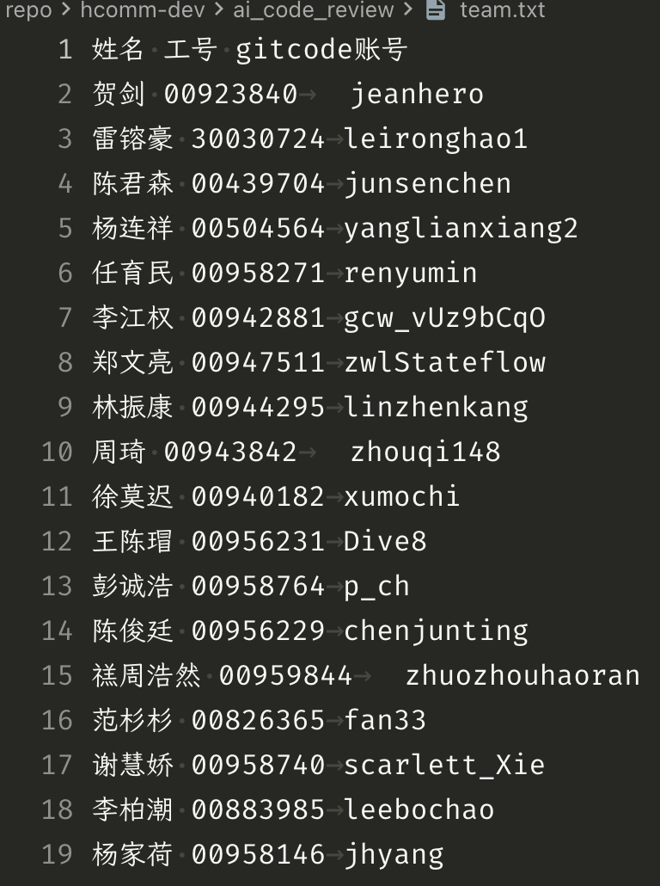
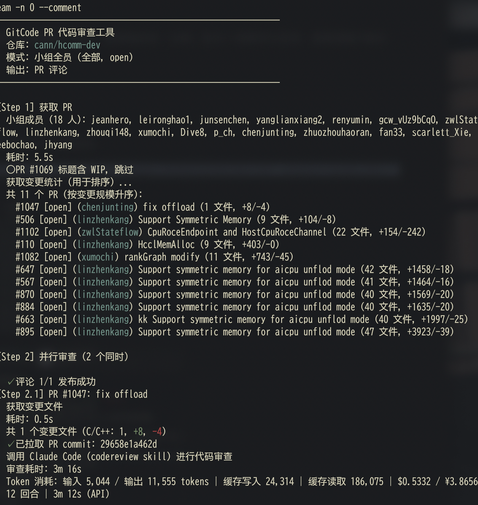
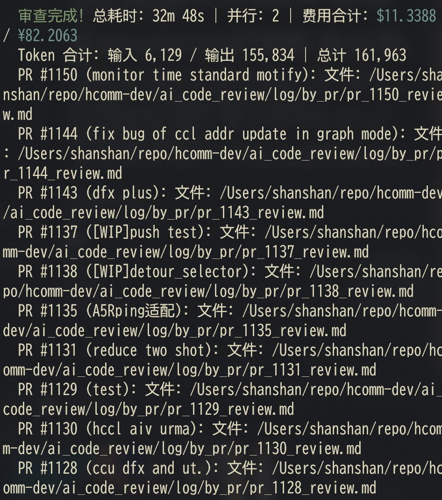
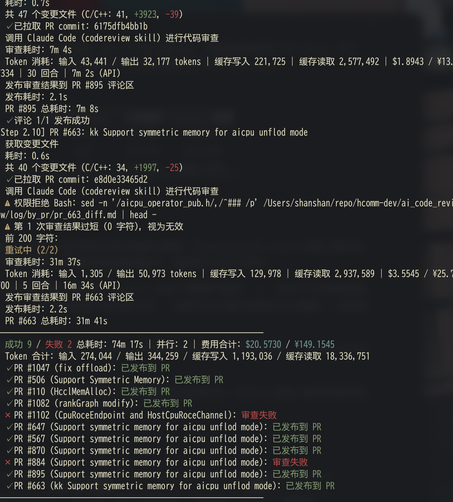
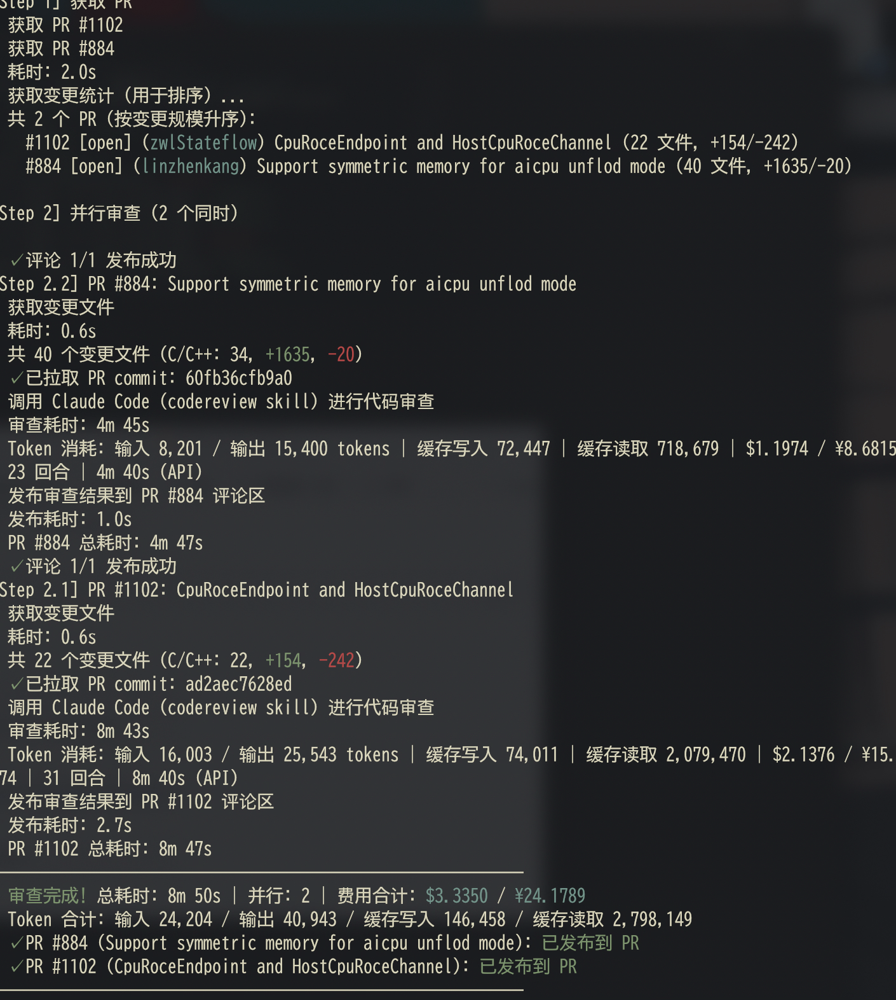
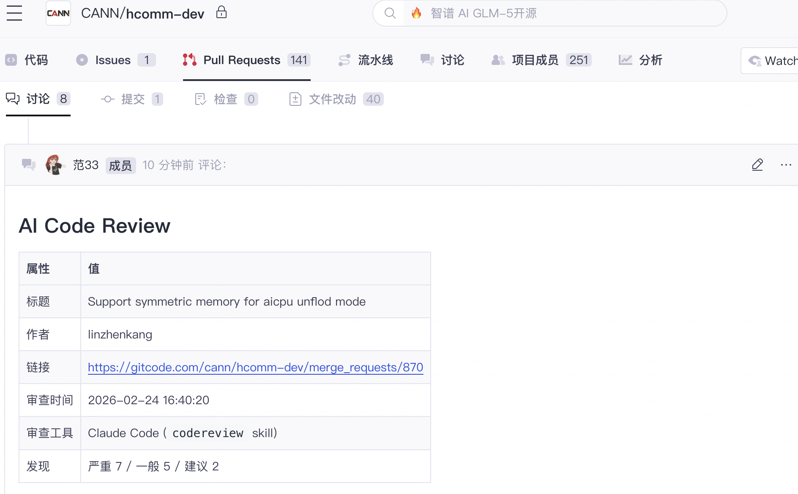
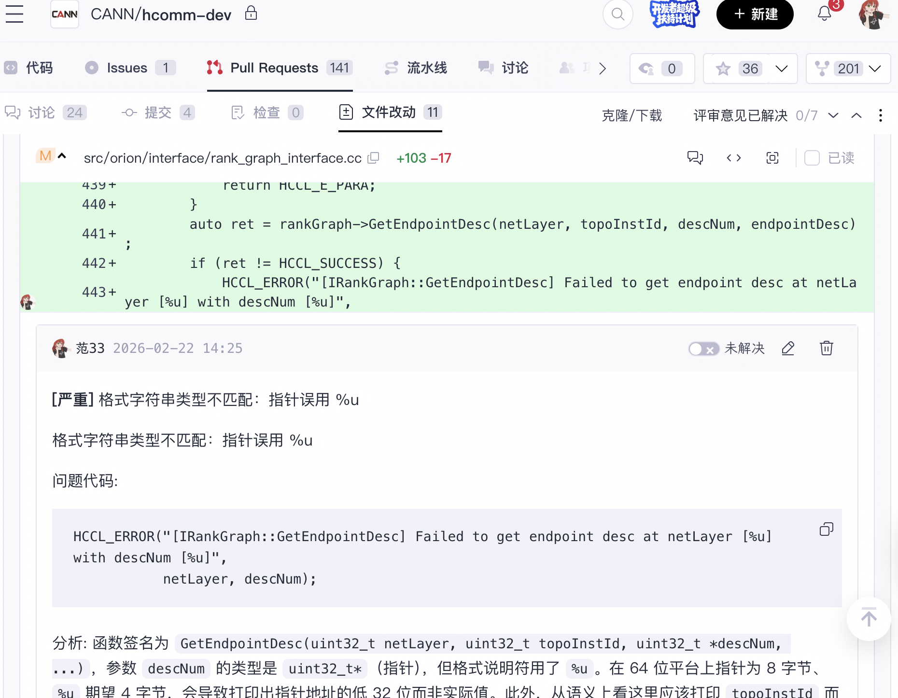
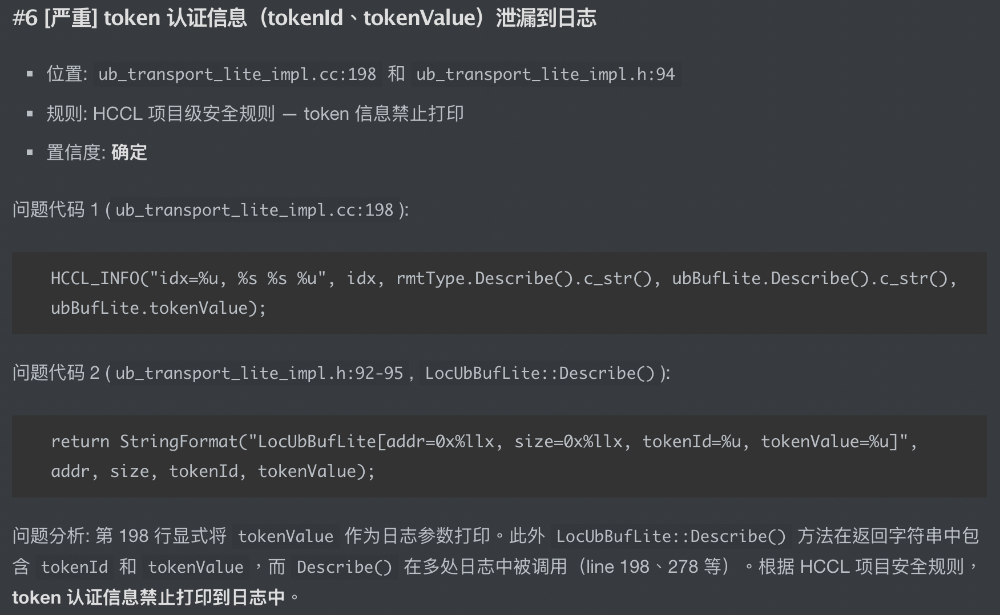
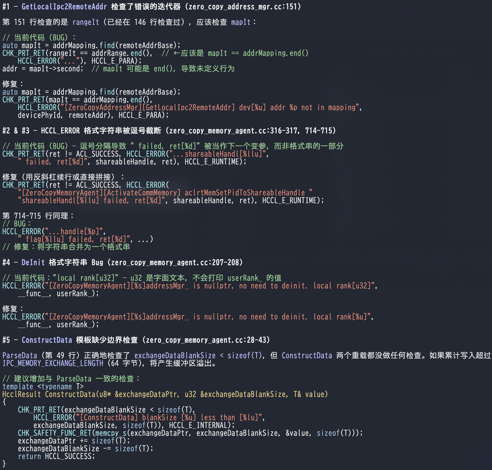

# 【蓝区/HCCL】AI辅助代码检视踩坑

## 背景

1. HCCL 需求主要在黄区和蓝区开发。黄区：David 需求；蓝区：OBP 需求。
2. CANN 领域的各算子组中，HCCL 代码量最大（含 HCCL 和 HCOMM），中硬 HCCL 问题单数量常年最多，通信算子特战队新人多，项目质量压力很大。
3. 编译器和传统静态分析工具（cppcheck、clang-tidy 等）可发现的问题类型有限。

## CC

Claude Code CLI 的三个优势：

1. [Skill 机制](https://github.com/anthropics/claude-code#skills)：把编码规范写成 skill，每次检视参照执行。
2. 工具调用：检视时按需读取文件和代码，不只看 diff。
3. 非交互模式：[`claude -p`](https://docs.anthropic.com/en/docs/claude-code/cli-usage) 支持脚本调用，能集成进自动化流程。

安装：

```bash
npm install -g @anthropic-ai/claude-code
```

启动：

```bash
claude --dangerously-skip-permissions --verbose
```

## 过程

### 裸模型

在终端里直接贴代码并提问"帮我看看"，能发现一些问题，效果孱弱，质量不稳定。

### with Skills

第一次质变。

```text
~/.claude/skills/codereview/
├── SKILL.md            # 检视流程、分级标准、输出格式
└── coding-standards.md # 多层编码规范：公司级(华为C++语言编码规范)->产品线级(CANN开放仓C++编程规范[建议稿])->部门级(算子特战队编码红线及TOPN问题)->项目级(HCCL集合通信库代码检视常见关注点)->个人级(本人的codereview习惯)
```

几个关键设计：

1. 置信度。每个发现标注严重程度和置信度（确定/较确定/待确认）。推广 AI 检视的一个很大的阻力不是漏报而是误报：站在版本经理/测试经理视角，我希望工具宁可错杀也不要放过，因为“越早发现缺陷，修复成本越低；越晚发现缺陷，修复成本越高——出自 Code Complete 第二版 3.1 节”，至于误报的问题可以由开发/MDE人工进行确认；站在开发人员视角，我不希望在紧张的迭代里程碑中连续收到一堆"言之凿凿，实则错误"的检视意见，这会让开发逐渐失去对整个工具链的信任（到后来看都不看一眼 AI 检视意见，直到忽视真正的问题）。标注置信度让人可以优先关注"确定"的发现结果，而对"待确认"的保持审慎的态度。
2. 规范分层。我把公司级、产品线级、部门级、项目级的规范全编进去。HCCL 特有的东西也加了一些进去——`tokenId`/`tokenValue` 禁止入日志、`CHK_RET` 宏检查返回值、`NEW_NOTHROW` 分配内存、历史高频缺陷 TOPN，外加本人积累的 67 条检视习惯。

Skill 的出现让"随缘检视"变成了"标准化检视"。

### GitCode 平台（fetch → review → comment）全流程打通

Skill 在一定程度上改善了检视意见的质量问题，但完整workflow依然依赖人工——下载 diff，发到终端，触发检视，再把结果贴回 PR。在检视大量PR 时上述流程将显得更加繁琐，效率很低，不利于推广。本人 vibe 了一个妙妙小工具 `ai_reviewer.py`，自动化 + 批处理了 fetch → review → comment 流程：

```bash
# 检视指定PR（支持复数）
python3 ai_code_review/ai_reviewer.py --pr 1082 --comment
# 检视指定作者的所有PR
python3 ai_code_review/ai_reviewer.py --author xumochi --count 0
```

看起来简单但其实麻烦的事不少，besides 这部分是非常具体的踩坑环节，只想看 cc 效果的人可以先略过，想在黄区自动化 codehub 工作流的人可以参考后面的，有一个单独的小节对脚本的开发进行介绍。

#### GitCode API

GitCode 的 API 兼容 Gitee V5，base URL `https://api.gitcode.com/api/v5`，认证走 `access_token` query 参数。

PR 列表接口不支持按 author 过滤，脚本只能客户端翻页 + 过滤：

```python
while (count == 0 or len(matched) < count) and page <= max_pages:
    data = api_get(f"/repos/{OWNER}/{REPO}/pulls", token,
                   {"state": state, "per_page": 20, "page": page})
    for pr in data:
        if pr["user"]["login"].lower() in authors_lower:
            matched.append(pr)
    page += 1
```

GitCode 的 diff 格式也与 GitHub 不同——GitHub 的 `patch` 是字符串，GitCode 的 `patch` 是嵌套对象，diff 文本在 `patch.diff` 字段中。

GitCode 的评论有 60K 字符限制，脚本需要在 `---` 分隔线处自动拆分并加序号。

每次发送新的评论前需要先删旧的 AI 评论，保证幂等。

#### 嵌套调用 Claude

`claude -p` 是 Claude Code 的"管道模式"，脚本通过 `subprocess` 调用 `claude -p`，diff 从 stdin 传入，报告从 stdout 读出。

一个未见于官方文档中的行为（来源：[GitHub issue #531](https://github.com/anthropics/claude-code/issues/531)）：Claude Code 通过 `CLAUDECODE` 环境变量检测嵌套运行。如果脚本在 Claude Code 终端内执行，该变量已存在，`claude -p` 会拒绝启动。脚本需要在 `subprocess` 的 `env` 参数中移除这个 key——注意是删除 key，不是设为空串。

```python
# 复制一份当前进程的环境变量但故意把 CLAUDECODE 剔除
env = {k: v for k, v in os.environ.items() if k != "CLAUDECODE"}
```

Claude 偶尔会在正式报告前输出推理过程（"让我先读取文件..."之类）。脚本需要正则定位第一个 `##` 标题，截取其后的内容作为正式报告。

### with Tools

第二次质变。

运行第 1 版脚本观察到一个不好的现象：同一段代码，终端的交互式检视明显比脚本批量检视的效果好很多。在 verbose 模式下对比观察 claude 执行日志后发现，cc 在终端里按需调用工具读取文件，而脚本只喂给它 diff 文件，由于 `claude -p` 管道模式下没有交互式终端，未预先授权的工具无法使用。授权方式有几种（`--allowedTools` CLI 标志、`settings.json` 的 `permissions.allow` 权限规则——有个已知 bug，[#581](https://github.com/anthropics/claude-code/issues/581)、`--permission-mode` 等，见 [Headless 模式文档](https://github.com/anthropics/claude-code#headless-mode)），脚本此处选用 `--allowedTools`，因为修改最简单且粒度最细。

三种方案：

| 方案 | 具体做法 | 效果 |
|------|------|------|
| 往 prompt 里塞文件 | 盲目注入 | 差 |
| `--allowedTools` | Claude 自己决定读什么 | 好 |
| MCP Server | 封装 GitCode API | 过度工程 |

方案 2 修改方式：

```python
cmd = ["claude", "-p", "--output-format", "text",
       "--allowedTools", "Read", "Grep", "Glob",
       "--allowedTools", "Bash(git show *)", "Bash(git log *)", "Bash(git diff *)",
       "--allowedTools", "Bash(git ls-tree *)", "Bash(git blame *)",
       "--allowedTools", "Bash(git branch *)", "Bash(git rev-parse *)",
       "--allowedTools", "Bash(git ls-files *)", "Bash(git grep *)"]
```

`Bash(git show *)` 解决分支不一致问题：本地是 master，PR 代码在远程分支，用 `git show <sha>:<path>` 读对应文件。

效果立竿见影。以 `ping_mesh.h` 为例，脚本中 cc 主动做了这些事：

1. 读 `ping_mesh.cc:627`，找到 `ipAddr_ = &ipAddr;`，确认是悬垂指针——`ipAddr` 是值传递形参，函数返回后销毁。
2. 读 `ping_mesh.cc:648`，追踪 `connThread_` 赋值路径，确认初始化失败时析构触发空指针。
3. 读 `ping_mesh.cc:603-623`，理解 switch-case 回滚逻辑，判断 fallthrough 是否有意。
4. 追踪 `new`（993 行）和 `delete`（642 行），确认裸指针生命周期问题。

假如仅靠 diff 文件，这些问题一个都发现不了，代价则是检视耗时从 60 秒上升到 5 分钟以上。

#### 使能工具调用导致无输出

启用工具调用后检视开始频繁失败——returncode=0，stdout 为空，每次耗时 240 秒。

最初怀疑方向是加了工具调用后 cc 更快触碰到了 agentic turns 的上限，但是查 claude code 文档后发现 [`--max-turns`](https://docs.anthropic.com/en/docs/claude-code/cli-usage) 默认无上限？然后又发现有时候终端在 returncode=0 之前能打出来一点点检视报告，猜测实际原因可能是上下文窗口耗尽了，因为工具每次 Read、Grep、git show 的输入输出都占用 context，占满之后 Claude 无法再继续生成文本回复。`--output-format text` 输出的是最后一次文本回复，如果 context 耗尽前最后的动作是工具调用而非文本输出，stdout 就是空的。

修改：

一，设 `--max-turns 40`。减少工具调用回合数，间接减少 context 消耗。

二，在 prompt 里约束工具的使用：

```text
控制工具调用次数：只在必要时使用工具。对于 diff 中已经足够清晰的问题，直接分析即可。目标是工具调用不超过 10 次。
```

没有这条约束，Claude 倾向于把所有相关文件逐一读取。40 个 turns 也不够用。加上约束后，它只在需要确认类型或追踪数据流时才使用工具。

三，增加诊断——全部重试失败后，做一次无工具的连通性测试，区分服务异常和 context 耗尽。

| 指标 | 修前 | 修后 |
|------|------|------|
| 结果 | 连续失败 | 稳定成功 |
| 耗时 | 484s | 79s |

给 AI 工具能力不等于让它无限制地使用。需要在 prompt 中明确指导它什么时候该用、什么时候不该用。

补充：随着对 context 消耗规律的理解加深（见后文"context 窗口"一节），发现限制工具调用虽然解决了无输出问题，却制造了新问题——误报率上升。很多发现因为没有用工具验证类型、追踪跨文件调用链，只能标"待确认"，实际是错的。当前版本的 prompt 已反转为"质量优先：发现一个真实的严重问题，比节省工具调用更有价值"，并列出了必须使用工具验证的场景（指针操作、算术运算、结构体成员变更等）。无输出问题改由两个参数协同控制，不再靠压缩工具使用来规避：

- `MAX_DIFF_CHARS = 80000`：输入端截断 diff，把 diff 占用控制在约 25k tokens，给工具调用留出 120k+ 空间
- `MAX_CLAUDE_TURNS = 40`（`--max-turns`）：执行端封顶回合总数，Claude 在 40 个回合内自由决定读多少文件，但回合用完必须输出结果

前者控制”喂进去多少代码”，后者控制”Claude 能探索多久”。

### 内联检视

现在所有检视意见挤在 PR 评论区一整段 markdown 里，开发需要自己再找到对应的代码。这一节想解决的问题是把每个检视意见直接提到对应的代码行上，这么做的另一个好处是方便精准采集每个 ai 检视意见的用户反馈（如果我也足够精准的话），可以让开发同学在错误生成的检视意见下面回复“人工智障”，然后我用脚本定期把仓库内的真实误报数据拿回来分析、统计、改进 skill。

这个功能本来预估两天完成，实际花了更多时间，迭代了 5 个版本。

#### V1：让 Claude 同时输出报告和 JSON

最直接的方案：在审查 prompt 末尾追加指令，让 Claude 在 markdown 报告后面附一段 JSON：

```text
---INLINE_FINDINGS_JSON---
[{"id": 1, "file": "src/xxx.cc", "line": 443, "body": "..."}]
---END_INLINE_FINDINGS_JSON---
```

失败了。问题不在解析，在检视质量——prompt 里多了 ~30 行格式说明后，可能是 Claude 的注意力被分散到 JSON 的格式正确性上？总之就是检视深度明显下降，关键问题开始被遗漏。

让 AI 同时承担深度分析和结构化输出两个目标，结果两个都做不好。

#### V2：两步法

第一步照常审查，保证质量；第二步用一个轻量 Claude 调用（`--max-turns 1`，不给工具），将报告和 diff 一起传入，让它交叉比对输出定位信息。同样失败了：大 diff 的 prompt 过长，第二次调用频繁超时，且额外的 API 调用使成本和延迟均翻倍。

#### V3：纯文本解析

不用第二次 Claude 调用，纯 Python 解析报告文本，在 diff 中搜索位置。

三层搜索策略：

```text
策略 1：从「位置:」字段提取行号（file.cc:395, 427, 457）
    ↓ 失败
策略 2：从「问题代码」块提取关键行，在 diff 中搜索匹配
    ↓ 失败
策略 3：从位置描述中提取函数名/标识符，在 diff 中搜索
```

第一版跑出来 10 个发现只定位到 1 个。

逐个分析发现，大部分检视意见根本没有 `file.cc:395` 格式的行号，只写"文件路径——函数名"；代码块提取的正则太死，Claude 的输出格式不一致（有时写"问题代码:"，有时写"以下代码模式..."）；搜索范围只覆盖了 diff 的 `+` 行，但很多发现指向已有代码（上下文行）；函数名搜索只认反引号+括号格式。修复措施：放宽正则、搜索范围扩到上下文行（优先 `+` 行）、加标识符提取兜底。修复后命中率从 1/10 上升到 14/14。

还有一个隐蔽 bug：`\ No newline at end of file` 这行 diff 元信息未被正确处理，落入 else 分支导致行号计数器错误递增，后续所有行号偏移 +1。一行代码的缺陷，影响整个文件的行号映射。

#### GitCode API：200 OK，但什么都没发生

定位问题解决后，脚本报告“8 条行内评论发布成功”，但 PR 页面上什么都没有。虽然 GitCode API 声称兼容 Gitee V5，而且返回了 200，但查询返回值发现 `path`、`position`、`commit_id` 全是 `N/A`，JSON body 中的参数被静默丢弃，只有 form-encoded 才生效。

排查了三个小时，基本就是试探 gitcode 服务器到底认哪种编码格式，大概过程如下：

1. JSON body（`Content-Type: application/json`）传 path/position/commit_id → 静默忽略
2. Form-encoded 传同样参数 → 还是忽略
3. 换 commit comments 端点 → "File Not Found"
4. 最后从一条报错信息 `line is missing, line_type is missing` 发现——GitCode 用的是 `line` + `line_type`，不是 GitHub 的 `position`

进一步测试发现只有 form-encoded 能正确设置行内参数，JSON body 就会被静默丢弃。

另一个发现是 GitCode 的 `position` 语义是源文件的绝对行号而非 GitHub 那样从 diff hunk 头算起的相对偏移，需要解析 `@@ -a,b +c,d @@` 来计算，既然不需要计算相对位置，那 diff position map 的构建、维护、边界处理全部可以删掉，代码大幅简化了，代价是长达好几小时的 API 考古。

```python
# GitHub: position = diff 相对位置
# GitCode: position = 源文件绝对行号
data = urlencode({"body": body, "path": path, "position": line_number, ...})
```

#### 自己删自己

API 问题解决后，又出现一个现象：行内评论发布后立刻消失。

追踪执行时序发现：脚本先发布了 7 条行内评论，随后调用 `post_review_comment()` 发布总结评论——该函数内部会先调用 `delete_old_review_comments()` 清理旧评论，识别标志是 `AI_REVIEW_MARKER`。而刚发布的行内评论包含 `AI_INLINE_MARKER`，被自己的清理逻辑全部删除了。所有 API 调用返回成功，日志显示"发布完成"，但 PR 页面上空空如也。

修复很简单：调整顺序（先删旧 → 发总结 → 发行内），总结函数加 `skip_delete` 参数。

#### 行号漂移

行内评论终于正常显示，但部分标注位置与实际问题代码存在 1-3 行的偏差。

根本原因是 Claude 的行号基于推断而非精确定位。报告中写"第 401 行"，实际问题可能在 399 行。在总结报告中这个偏差可以接受，但在行内批注中就是定位错误，目前的处理办法比较简单粗暴，添加了两层校正：

1. Skill 层：在 codereview 流程中加了"行号自查"步骤，要求 Claude 输出报告前回读文件验证行号。
2. 脚本层：`_verify_and_correct_line()` 从 diff 建立 `{行号: 内容}` 映射，提取发现中的代码关键词，检查报告行号处的内容是否匹配，不匹配就在 ±5 行范围内搜最佳匹配并自动纠正。

```python
for finding in findings:
    expected_keywords = _extract_code_keywords(finding.body)
    actual_content = diff_line_map.get(finding.line, "")
    if not _content_matches(actual_content, expected_keywords):
        corrected = _search_nearby(diff_line_map, finding.line, expected_keywords, radius=5)
        if corrected:
            finding.line = corrected
```

#### 性能

第一版的发布阶段 10 条评论串行发布，加上清理旧评论被调用了两次，整体耗时约一分钟。改为 5 线程并行发布、清理逻辑只执行一次后，降至约 2 秒。

## 效果

### 妙妙小工具

效果：一键检视 HCCL 算子特战队全部成员在 gitcode 私仓 12 个开发中的 PR 全部成功。

名单配置：







偶尔还是会失败，主要是工具调用相关约束，最近还在完善中。





评论模式，开启 `--comment` ：

https://gitcode.com/cann/hcomm-dev/pull/870



评论模式（內联），开启 `--comment --inline`：



### ai发现的一些问题

以下按问题类型列出代表性发现，侧重展示 AI 检视相对于编译器/传统静态检查工具/人类的某些优势。

#### Copy-paste 导致检查了错误的变量

零拷贝地址管理器中，连续查两个 map，保护检查复制后忘了改变量名：

```cpp
auto rangeIt = addrRange.find(range);
CHK_PRT_RET(rangeIt == addrRange.end(), ...);       // ✓ 检查 rangeIt

auto mapIt = addrMapping.find(remoteAddrBase);
CHK_PRT_RET(rangeIt == addrRange.end(), ...);       // ✗ 应检查 mapIt
addr = mapIt->second;                                // mapIt 可能是 end() → 崩溃
```

两行代码结构完全相同，变量名只差几个字符。当地址被 reserve 但 mapping 未建立时，`mapIt` 等于 `end()`，下一行解引用直接崩溃。人眼容易"扫一眼觉得差不多"就跳过，AI 会逐变量比对。

#### sizeof(std::vector) 误用

```cpp
connOut.dataSize = sizeof(wqeData);  // wqeData 是 std::vector<char>
```

`sizeof(std::vector<char>)` 在 64 位平台返回 24（容器对象本身三个指针的大小），而非数据长度。`wqeData` 刚被 `resize(128)`，但 `connOut.dataSize` 拿到 24，下游所有 WQE 数据传输使用错误长度。正确写法是 `wqeData.size()`。编译器不会报任何警告。

#### 格式字符串被逗号截断

```cpp
CHK_PRT_RET(ret != ACL_SUCCESS, HCCL_ERROR(
    "...shareableHandl[%llu]",    // ← 注意这个逗号
    " failed, ret[%d]",
    shareableHandle, ret), HCCL_E_RUNTIME);
```

开发者想利用 C++ 字符串字面量自动拼接（`"A" "B"` → `"AB"`），但两段字符串之间多了一个逗号。宏展开后逗号变成参数分隔符，format 实际上只有 `"...shareableHandl[%llu]"`，`%llu` 匹配到第二个字符串的指针地址——未定义行为。同一模块中出现两处，模式完全相同，典型的 copy-paste 传播。

#### 失败路径无回滚导致资源永久泄漏

```cpp
CHK_RET(addressMgr_->ActivateCommMemoryAddr(devPtr, size));  // 1. 标记 activate
ret = aclrtMemImportFromShareableHandle(..., &pHandle);       // 2. 可能失败
CHK_PRT_RET(ret != ACL_SUCCESS, ..., HCCL_E_RUNTIME);        //    失败 return，activate 未回滚
ret = aclrtMapMem(devPtr, size, offset, pHandle, flags);      // 3. 可能失败
CHK_PRT_RET(ret != ACL_SUCCESS, ..., HCCL_E_RUNTIME);        //    失败 return，pHandle 泄漏
```

三步操作的执行顺序有问题。`ActivateCommMemoryAddr` 在两个可能失败的外部 API 之前执行，但失败路径都没有回滚。第 2 步失败时地址区间被永久标记为 activated，阻塞后续所有操作；第 3 步失败时还额外泄漏设备内存句柄。每个 `CHK_PRT_RET` 各自正确处理了当前步骤的错误，但没有考虑前置步骤的副作用——多步资源获取中最常见的遗漏模式。

#### 无符号整数下溢（BatchTransfer）

```cpp
u32 insNum = loc.size();
for (u32 i = 0; i < insNum; i++) { ... }
if (transferOp[insNum - 1].reduceIn.reduceOp == ReduceOp::INVALID) { ... }
```

`loc` 为空时 `insNum = 0`，循环不执行。但循环外 `insNum - 1` 在 `u32` 上下溢为 `0xFFFFFFFF`——`transferOp[4294967295]`，灾难性越界。同一函数还有另一个隐患：循环同时以 `i` 索引 `loc`、`rmt`、`transferOp` 三个 vector，但只用 `loc.size()` 作边界，若三者长度不同则越界。

#### 跨文件遗漏（PR #276）

PR 只改了 2 个头文件（删 `HcclCommConfig` 的 `hcclBufferName` 字段），diff 总共 5 行。AI 全仓搜 `bufferName`，发现框架层 6 个文件还有完整的处理逻辑没清理。

更关键的是：删字段后内存布局变了（少 128 字节），但框架层的 `SetConfigBufferName` 仍按旧布局访问。不是残留代码，是内存安全问题。

人类 reviewer 看到"只改了 2 个头文件"的 5 行 diff，可能不会去全仓 grep 被删字段的所有引用。AI 会。

#### 敏感信息泄露

```cpp
HCCL_INFO("idx=%u, %s %s %u", idx, rmtType.Describe().c_str(),
    ubBufLite.Describe().c_str(), ubBufLite.tokenValue);
```

双重泄露：`tokenValue` 作为 `%u` 直接输出，同时 `Describe()` 返回值内部也包含 `tokenId` 和 `tokenValue`。对比同类的 `RmtUbBufLite::Describe()` 正确地未包含敏感字段——两个 Describe 方法安全级别不一致。HCCL 项目规则明确禁止 `tokenId`/`tokenValue` 入日志，属产品网络安全红线。



#### 跨文件调用链死锁

```cpp
// zero_copy_address_mgr.cc
HcclResult ZeroCopyAddressMgr::ProcessRingBuffer(...)
{
    std::lock_guard<std::mutex> guard(processRingBufferLock_);
    needPushOne = false;
    CHK_RET(ProcessOneAddrMap(ringBuffer[now]));
    // → ProcessOneAddrMap → AddLocalIpc2RemoteAddr → PushOne
}

// zero_copy_address_mgr_host.cc（另一个文件）
HcclResult ZeroCopyAddressMgr::PushOne(...)
{
    std::lock_guard<std::mutex> guard(processRingBufferLock_);  // 同一把锁 → 死锁
    if (!needPushOne) { return HCCL_SUCCESS; }                  // 永远执行不到
}
```

`ProcessRingBuffer` 持有 `processRingBufferLock_`，调用链经 `ProcessOneAddrMap` → `AddLocalIpc2RemoteAddr` 到达 `PushOne`。`PushOne` 再次获取同一把 `std::mutex`——不可重入，未定义行为，通常表现为死锁。代码中设了 `needPushOne = false` 想让 `PushOne` 跳过，但检查在 `lock_guard` 之后——锁拿不到，检查永远执行不到。

两个函数分布在不同 `.cc` 文件中，各自独立看都是标准的 RAII 加锁写法，毫无破绽。AI 通过工具调用追踪了四层调用链，跨越两个源文件，才将问题定性为锁重入死锁。

#### 实例锁无法保护静态资源

```cpp
// zero_copy_address_mgr.h
static std::shared_ptr<ZeroCopyAddressMgr> addressMgr_;  // 静态成员，多实例共享
u32 commRefCnt_{0};                                        // 非原子引用计数

// zero_copy_memory_agent.h
std::mutex commRefCntLock_;                                // 实例成员锁（非 static）
```

`addressMgr_` 是静态成员，多个 `ZeroCopyMemoryAgent` 实例共享。但保护它的 `commRefCntLock_` 是实例成员——每个实例各有一把锁，互不互斥。两个实例并发调用 `Init()` 时，各自锁各自的 `commRefCntLock_`，`commRefCnt_++` 形成数据竞争，`addressMgr_` 可能被重复初始化或提前销毁。

这类 bug 不会在单实例测试中暴露，只有在多 communicator 并发场景下才会触发。AI 分析了锁的作用域（实例级）与被保护资源的作用域（类级/静态），判定两者不匹配。

#### 零拷贝其它



以上发现经人工确认均需修改。

## 提高检视意见质量的方法

功能跑通之后，核心问题变成了质量。"能检视"和"检视得好"完全是两回事。

### 输出风格污染

有一段时间，脚本的批量审查突然开始频繁失败——6 个 PR 只有 2 个产出了有效报告，其余 4 个输出不足 500 字符。

原因出乎意料：项目目录下的 `.claude/settings.local.json` 配置了 `"outputStyle": "Explanatory"`。`ai_reviewer.py` 通过 `subprocess` 调用 `claude -p`，子进程以 `cwd=hcomm-dev/` 运行，自动加载了这套配置。结果是：codereview skill 要求输出 `## 变更概述 / 审查发现 / 总结` 格式，Explanatory 风格要求输出 `★ Insight` 教育块——两套指令在竞争有限的文本输出空间。

证据很清楚：4 次失败中 2 次以 `★ Insight ─────` 开头，整段输出是教育性质的说明而非检视报告；另外 2 次则输出了简要表格摘要（"审查完成。总结发现 3 个问题：| 级别 | 问题 |..."），也不是完整报告。

修复做了三层防御：

1. 环境变量层——`subprocess` 的 `env` 中设置 `CLAUDE_CODE_OUTPUT_STYLE=""`，尝试阻止子进程加载 outputStyle 配置。
2. Prompt 层——审查 prompt 开头明确写"忽略 outputStyle 设置，以 `## 变更概述` 开头"。
3. 后处理层——`_clean_review_output()` 增加 `★ Insight` 块剥离逻辑。

三层中 prompt 层最可靠——它在 Claude 的推理过程内部生效，不受外部配置加载顺序的影响。环境变量层和后处理层都是外围补救，无法从根本上解决指令冲突。经验是：`claude -p` 子进程会继承当前目录的各种配置（`settings.local.json`、`.claude/` 目录），如果项目级配置与 skill 指令冲突，结果不可预测。更普遍的原则：任何通过 subprocess 调用 LLM 的场景，都应该把子进程的执行环境当作不可信的——显式设置每一个关键参数，而非假设默认值合理。

### Skill 语言的选择

探索过一个问题：codereview skill 用中文写还是英文写？直觉上英文可能让 Claude 表现更好，毕竟训练数据中英文代码审查内容远多于中文。

实测结论：没有差异。Claude 对中英文 prompt 的遵循度基本一致。而中文 skill 有几个实际优势：输出的审查报告天然是中文，团队成员阅读无障碍；规则描述能精确对应 CANN 编码规范原文；维护成本更低。

真正影响检视效果的不是 skill 的语言，而是三个因素：规则是否具体到可机械执行（"禁止裸指针"不如"`new` 必须配对 `delete` 或使用 `NEW_NOTHROW` 宏"）；是否有正例和反例对比；是否覆盖了项目特有的高频缺陷模式。

### Skill 的打磨过程

SKILL.md 从最初 200 行迭代到 400+ 行，coding-standards.md 从 800 行到 1200+ 行。不是一次写成的，每一行的增删都对应一个具体的漏检或误报。

#### 两个文件，两个职责

最初规范和流程写在一个文件里，很快就乱了——修改输出格式时容易误改编码规则，想单独查规范也找不到。拆成两个文件后职责清晰：

```text
SKILL.md → "怎么检"：检视流程、工具策略、必检规则、输出格式、置信度定义
coding-standards.md → "检什么"：公司级/产品线级/部门级/项目级/个人级编码规范
```

拆分还有一个实际好处：coding-standards.md 可以被多个场景复用（文件检视、PR 检视、目录检视），而 SKILL.md 可以调整流程而不影响规范本身。

#### 规范分五层

coding-standards.md 中的规范分五层，每层解决不同的问题：

| 层级 | 内容 | 说明 |
|------|------|------|
| 公司级 | 华为 C++ 编码规范 | 基础底线（目前仅占位） |
| 产品线级 | CANN C++ 编程规范 | ~1000 行，带正反例代码，覆盖命名/格式/安全函数等 |
| 部门级 | 算子编码红线 + TOPN | 7 条红线 + 13 条高频问题 |
| 项目级 | HCCL 特有规则 | tokenId/tokenValue 禁入日志、`CHK_RET` 宏、`NEW_NOTHROW` 等 |
| 个人级 | 67 条检视习惯 | 按业务/施工/设计/安全/维测/性能分类 |

上面三层是通用规则，大多数 C++ 项目都适用。下面两层是项目专属知识——这是 AI 检视区别于通用 lint 的关键。没有项目级规则，AI 不知道 `tokenValue` 是敏感信息；没有个人级习惯，AI 不会去检查"日志归属 PID 是否正确"或"内存泄漏在最差情况下可以支撑多久不复位"。

规范越详细，占用 context 越多。coding-standards.md 全量加载约占 8k-15k tokens。当前的折衷是保持规范完整但精简示例代码，命名规范和禁用函数做成速查表而非逐条展开。

#### 检视流程的固化

SKILL.md 中最重要的不是规则本身，而是检视流程的步骤化：

```text
第 1 步：理解变更上下文 → 通读 diff，主动读调用者、头文件、基类
第 2 步：工具验证       → 指针/算术/结构体变更等场景必须用工具确认
第 3 步：逐条过筛必检规则 → 9 条硬性规则，命中即严重
第 4 步：分层检查其余规则 → 严重/一般/建议三级
第 5 步：输出格式化报告   → 逐条块状，附行号自检
```

最初没有步骤化，Claude 的检视路径完全随机——有时先看命名规范再看内存安全，有时反过来。步骤化之后，Claude 的行为变得可预测：先理解意图，再逐条过筛硬性规则，最后检查软性规则。

其中"第 2 步：工具验证"是后来加的。最初 Claude 有时用工具验证了一个发现的置信度，有时又不用，完全取决于推理路径。加入明确的"必须用工具确认"场景清单后：

```text
- 指针赋值/传递 → 读函数签名，确认值传递 vs 引用
- 算术运算     → 读变量声明，确认类型和值域
- 结构体成员增删 → grep 所有引用点
- sizeof()     → 确认操作数类型
```

工具使用变得有目的性，置信度标注也更准确。这不是约束，是指引。

#### 高价值缺陷模式的积累

SKILL.md 末尾有一个"高价值缺陷模式"清单，目前 12 条。不是从教科书抄的，每条都来自实际检视中的真实缺陷：

| 模式 | 来源 |
|------|------|
| sizeof(容器) 误用 | `ub_transport_lite_impl.cc` 的 `connOut.dataSize` |
| 值传递悬垂指针 | `ping_mesh.cc` 中 `ipAddr_ = &ipAddr` |
| 秒转毫秒溢出 | PR #1150 的 `taskMonitorInterval_ * 1000` |
| 格式字符串不匹配 | PR #1143 的 `HCCL_RUN_INFO` 缺参数 |
| 跨文件遗漏清理 | PR #276 的 `hcclBufferName` 字段删除 |
| 不可重入锁死锁 | `zero_copy_address_mgr` 的跨文件调用链 |
| 实例锁与静态资源作用域不匹配 | `zero_copy_memory_agent` 的 `commRefCntLock_` |

这些模式写进 skill 后，Claude 对类似代码的敏感度显著提高。比如 sizeof 误用，加入前只有在"读了源文件确认类型"的情况下才能发现；加入后 Claude 会主动对 `sizeof(变量)` 检查变量是否为容器类型。这些模式有一个共同特征：编译器不报警告，代码在视觉上完全正常，只有理解语义才能发现问题。这恰恰是 AI 检视相对于静态分析工具的核心优势——它不检查语法，它理解意图。

#### 输出格式的设计

迭代了多版，最终固化的几个决策：

1. 不用表格。最初试过 `| 级别 | 位置 | 问题 |` 的表格格式，代码片段在表格单元格中几乎不可读。改为逐条块状输出，每个发现含位置、规则编号、置信度、问题代码（4 空格缩进）、修复建议。
2. 行号自检。让 Claude 在输出前对照 diff 的 `@@ +行号 @@` 验证行号。关键细节：hunk 头的行号指的是第一个上下文行，不是第一个 `+` 行。不在 skill 中明确说明，Claude 的行号会系统性偏移。
3. "待确认"集中放末尾。读者最关心确定的严重问题，不确定的放最后。无发现直接输出"未发现问题"——不要为了显示"我认真看了"而凑低价值的建议。

#### 反面经验

1. 公司级规范至今空着。华为内部 C++ 编码规范 300+ 页 PDF，逐条录入 skill 的 ROI 太低。产品线级的 CANN 规范已覆盖绝大部分通用场景。
2. 67 条个人习惯有些过细。"常量在右"、"连续空行"这类规则对 AI 价值不大——Claude 本身就能识别。真正有价值的是需要领域知识的条目，比如"内存泄漏第一时间分析影响：一个原子操作、一天、一年分别泄漏多少？最差情况可以支撑多久不复位？"如果重新整理，会精简到 30-40 条核心规则。
3. 规范与 context 的矛盾。规范写得越详细、示例越多，留给代码和工具交互的 context 空间越少。考虑过按模块动态加载规范（审查 transport 代码时只加载网络相关规则），但实现复杂度不值得。当前策略是保持完整但压缩格式——速查表优于逐条叙述。

### 必检规则与严重级别稳定性

同一个 PR 多次检视，严重级别偶尔不一致。一个格式字符串参数缺失的问题（`HCCL_RUN_INFO` 有 `%u` 占位符但缺参数），一次被标为"严重——未定义行为"，另一次被标为"一般——日志质量"。

根因是严重级别分类规则全部写在 SKILL.md 中，prompt 只说"请使用 codereview skill"。Claude 在不同推理路径下对规则的权重解读不同，没有强制性的逐条匹配机制。

解决方案是在 SKILL.md 中增加"必检规则清单"——9 条硬性规则，命中即严重、不可降级：

1. 格式字符串参数不匹配（占位符与实参数量/类型不一致）
2. 整数溢出/下溢（算术运算超出类型值域，无符号减法回绕）
3. 空指针解引用（未校验的指针或迭代器直接访问）
4. 数组/容器越界（未做边界检查的 index 访问）
5. `sizeof` 误用（`sizeof(容器)` 当作数据大小）
6. 资源泄漏（失败路径缺少回滚或释放）
7. 安全函数返回值未检查（`memcpy_s` 等返回值被 `(void)` 丢弃）
8. 敏感信息泄露（`tokenId`/`tokenValue` 入日志）
9. 并发安全（非原子变量跨线程读写，锁粒度不匹配）

配合检视流程调整为"先逐条过筛必检规则，再分层检查其余问题"。这 9 条规则全部来自实际检视中反复出现的高频缺陷，不是凭空设计的。

一开始我把必检规则嵌在了 `ai_reviewer.py` 的 prompt 中。后来感觉有点违反职责分离——规则散布在 skill 和 prompt 两个地方，维护时容易遗漏。最终把规则统一收归 SKILL.md，脚本的 prompt 只负责流程控制（工具预算、输出格式要求）。

### 工具预算与质量的平衡

前面提到启用工具调用后 context 耗尽导致无输出的问题。`--max-turns` 和粗粒度的工具约束修复了硬性故障，但更细微的问题随之浮现：Claude 对工具的使用缺乏策略性。PR #1082 的一次检视跑了 16 个回合、耗时近 5 分钟，context 逼近 200k 上限。Claude 把每个相关文件都读了一遍，包括 diff 本身就足以判定的格式字符串问题——它也要去读源文件"确认一下"。

最直接的做法是在 prompt 中限制调用次数。实测对比：

| 工具预算 | 平均回合 | 平均耗时 | 检出质量 |
|----------|----------|----------|----------|
| 不限制   | 16-19    | 4-5 min  | 高，但不稳定 |
| ≤ 20     | 11-14    | 3-4 min  | 高 |
| ≤ 5      | 5-8      | 1.5-2.5 min | 高，偶有漏检 |

但硬性数字约束过于粗暴——有些 PR 需要 8 次工具调用才能覆盖关键路径，有些 2 次就够。一刀切的上限不是让 Claude 浪费回合，就是让它错过关键验证。

最终演化为场景化指引——不限制总次数，而是明确什么时候必须用、什么时候不需要用：

- 必须用工具：指针操作要读函数实现确认是否返回 null；算术运算要读变量声明确认类型和值域；结构体变更要 grep 所有引用点；`CHK_PRT_RET` 等错误处理宏要确认保护条件是否匹配正确的变量（前面 copy-paste 迭代器错误就是这类问题）。
- 不需要工具：格式字符串占位符和实参数量匹配、命名规范检查、逗号截断等纯文本模式——直接从 diff 判定即可。

效果：Claude 的工具使用变得有针对性，平均 6-10 个回合，耗时 2-3 分钟，检出质量与"不限制"持平但稳定性显著提升。

`MAX_CLAUDE_TURNS` 设为 40 作为安全兜底。核心经验：与其限制 AI 的资源总量，不如指导它的资源分配策略。

### Context 窗口：200k tokens 意味着什么

200k tokens（见 [Claude 3 Family](https://www.anthropic.com/news/claude-3-family)）听起来很多——差不多是一本中等篇幅技术书的全文。但 agentic 模式下，静态容量和动态消耗是两回事——Anthropic 称之为 [context engineering](https://www.anthropic.com/engineering/effective-context-engineering-for-ai-agents)，每个额外 token 都在消耗有限的"注意力预算"。每一次工具调用的输入输出都会永久累积在 context 中，一次 10 回合的检视可能消耗的 context 远超 diff 本身的数倍。理解这个数字在代码审查中的实际含义，是设计审查流程和各项参数的基础。

#### tokens 与代码的换算

C++ 代码中密集的短标识符、运算符、花括号、分号，tokenize 后密度高于自然语言。实测 C++ 代码大约 1 token ≈ 3-4 个字符，一行典型代码（60-80 字符）约 15-25 tokens。粗略换算：

| tokens | 约对应 C++ 代码 |
|--------|-----------------|
| 10k | 400-600 行 |
| 50k | 2000-3000 行 |
| 100k | 4000-6000 行 |

但这只是静态的"能装多少"。代码审查是 agentic 过程，context 的消耗是动态累积的。

#### 固定开销

`claude -p` 每次调用是独立会话，context 从零开始。还没传入一行待审代码，以下内容已经占据了空间：

- System prompt + 项目指令：Claude Code 自身的系统指令加上项目目录下的 CLAUDE.md，合计约 8k tokens
- 工具定义：Read、Grep、Glob、Bash 等工具的 JSON schema，约 17k tokens
- Skill 文件：codereview SKILL.md（400+ 行）+ coding-standards.md（1200+ 行），约 5k tokens

合计约 30-40k tokens（skill 文件的份额与规范长度成正比——规范写得越详细、示例越多，留给代码的空间越少）。再预留 8-10k 给最终报告的生成空间，实际可用于代码和工具交互的空间约 150-160k tokens。

纯 diff 审查（不启用工具）时，150k+ tokens 可容纳约 45-50 万字符——远超脚本中 `MAX_DIFF_CHARS = 80000` 的限制。这个限制不是 context 的技术上限，而是为工具调用预留空间的质量上限。

#### Agentic 模式下的消耗

启用工具后，每个回合都在累积消耗 context：Claude 的推理文本每回合约 300-800 tokens，工具调用请求约 100-200 tokens，而工具返回结果变化最大——Read 一个 500 行文件约 8k tokens，Grep 结果约 1-3k tokens。

关键点：工具返回的内容永久留在 context 中，直到会话结束或被压缩。读 5 个 500 行的文件，光结果就消耗约 40k tokens。加上 Claude 在每个回合的推理文本、diff 本身、固定开销，一次 10 回合的带工具审查实际消耗可达 120-160k tokens。

几个 PR 的 context 占用估算：

| 审查场景 | diff（tokens） | 工具调用 | context 峰值 |
|----------|---------------|----------|-------------|
| 小 PR（3 文件，200 行） | ~6k | 3-5 次 | 60-80k |
| 中 PR（8 文件，600 行） | ~18k | 8-12 次 | 120-160k |
| 大 PR（15 文件，1500 行） | ~45k | 15+ 次 | 逼近 200k |

#### context 占用过高的后果

两层，严重程度不同：

一，隐性退化——分析深度下降。context 中内容越多，Claude 对早期内容的处理越不精确。Claude Code 在 context 接近上限时还会触发 [autocompact](https://simonwillison.net/2025/Jun/29/agentic-coding/)——用摘要替代早期对话内容来腾出空间。代码审查需要精确细节，而摘要天然丢失细节。

本人观察到三个具体现象。一，早期读取的类型声明在后续分析中被误判，`uint32_t` 变成了模糊的"整型"。二，文件行号从精确值退化为近似值，与前面"行号漂移"一节的问题叠加。三，Claude 重复读取已读过的文件——说明它对早期内容确实记忆模糊了，而重复读取又进一步消耗回合和 context，形成恶性循环。

二，显性失败——无输出。前面"工具调用导致无输出"一节已经描述——context 完全耗尽后 Claude 无法生成回复，`--output-format text` 输出空字符串。

隐性退化比显性失败更危险。显性失败有空输出可以检测，脚本能自动重试；隐性退化没有任何信号，只有人工复查才能发现检视深度下降。

#### 容量规划

三种审查模式的设计都围绕 context 预算：

| 模式 | 关键参数 | context 状况 | 说明 |
|------|----------|-------------|------|
| PR 模式 | `MAX_DIFF_CHARS = 80000` | diff 约 25k tokens，留 120k+ 给工具和分析 | 最常用，context 一般够用 |
| 文件模式 | 单文件 | 总消耗 80-100k，远未触及上限 | 检视质量最高 |
| 目录模式 | `MAX_DIR_FILES = 20` | 只列路径不嵌内容，Claude 按需读取 | 超过 20 文件后半段质量明显下降 |

核心原则：context 窗口不是一个可以装满的容器，而是一块有限的工作台。同时摊开的文件越多，每个文件分到的注意力越少。宁可分多次审查，每次聚焦少量文件。

直接回答"一次能高质量检视多少代码"：

| diff 规模 | 审查质量 |
|-----------|----------|
| ≤300 行 | 精细——深度追踪每条路径，几乎无遗漏 |
| 300-800 行 | 良好——主路径完整覆盖，边缘路径偶有不足 |
| 800-1500 行 | 可用——核心逻辑能覆盖，需人工补充边缘场景 |
| >1500 行 | 下降——后半段文件分析明显粗糙，应拆分审查 |

以上假设启用工具调用（平均 6-10 次）。关闭工具只看 diff，可审查的代码量大致翻倍，但质量降一个等级——无法验证类型、追踪跨文件调用链、确认资源生命周期，很多发现只能标"待确认"。

### Prompt Cache 与速度波动

同一个 PR 的两次审查，耗时可能差一倍（一次 4 分钟，一次 6 分半）。最初怀疑是脚本代码问题，排查后确认是 Anthropic API 端的 [prompt caching](https://www.anthropic.com/news/prompt-caching) 机制。

Claude Code 的 system prompt、工具定义、skill 文件在每次调用中都相同，这部分会被 API 端缓存。缓存命中时 input tokens 中大部分走缓存读取（cost 低至原价 1/10、处理速度快），缓存未命中则需要全量处理。缓存的默认生命周期约 5 分钟——超过这个间隔后需要重新预热。

实际影响：批量审查多个 PR 时，第一个总是最慢（冷启动），后续逐渐加速。连续对同一 PR 重复运行（调试时常见），前两次可能差异较大，之后趋于稳定。

利用这个机制的实践：批量审查时紧凑安排（间隔 < 5 分钟），避免在两次审查之间插入长时间操作导致缓存过期。调试 prompt 或工具策略时，先用小 diff 快速迭代（利用缓存加速反馈循环），确认效果后再跑大 diff。评估性能优化效果时，必须对比同等缓存状态下的耗时——否则会把缓存预热误判为代码优化的功劳。

### 跨文件审查的取舍

`--file` 模式对每个文件独立生成检视报告，后来有需求做跨文件分析——比如 `.h` 和 `.cc` 的接口一致性、结构体定义与使用的同步性。

本人评估了两种方案：

一是合并报告——多文件生成一份 MD。优点是 Claude 能看到所有文件，劣势是大目录容易超出 context、无法并行、单文件修改需要全部重新审查。

二是保持独立报告，但让 Claude 在审查单个文件时主动读取关联文件。这更灵活——并行友好、增量审查只需处理变更文件、与 PR 模式（天然多文件合一）互补。

最终选择了方案二作为默认行为，同时新增 `--dir` 模式作为需要跨文件审查时的显式选项。`--dir` 模式限制文件数（`MAX_DIR_FILES = 20`），prompt 列出文件路径但不嵌入内容，Claude 用工具按需读取。

实测验证了方案二的效果：对 `zero_copy/` 目录（6 文件，1330 行）的跨文件审查一次性发现 16 个问题，其中 9 个严重级别。最有价值的发现——copy-paste 迭代器检查错误、格式字符串逗号截断、失败路径资源泄漏——都需要跨文件追踪才能定性。单文件模式下这些问题会被标为"待确认"，因为无法验证跨文件的数据流。

## `ai_reviewer.py` 说明

### 帮助手册

#### 环境准备

- Python 3.10+（使用了 `X | Y` 联合类型语法）
- Claude Code CLI 已安装且在 `PATH` 中（脚本通过 `claude -p` 调用）
- codereview skill 已安装到 `~/.claude/skills/codereview/SKILL.md`
- GitCode 个人访问令牌（PR 审查需要，本地文件审查不需要）

设置令牌：

```bash
export GITCODE_TOKEN=your_personal_access_token
# 或在命令行中传入: --token your_token
```

#### 命令行参数一览

| 参数 | 类型 | 说明 |
|------|------|------|
| `--pr NUM [NUM ...]` | int 列表 | 指定 PR 编号（精确模式，不受 `--count`/`--author`/`--state` 影响） |
| `--file PATH [PATH ...]` | 字符串列表 | 审查本地文件或目录（目录递归扫描 C/C++，不需要令牌） |
| `--dir DIR [DIR ...]` | 字符串列表 | 跨文件审查整个目录（生成一份合并报告，不需要令牌） |
| `--author USER [USER ...]` | 字符串列表 | 按用户名筛选 PR |
| `-n` / `--count` | int | PR 数量上限（默认 3，0 表示全部） |
| `--state` | 枚举 | PR 状态：`open`（默认）、`merged`、`closed`、`all` |
| `--token` | 字符串 | GitCode 访问令牌（也可用环境变量） |
| `--comment` | 开关 | 将审查结果发布为 PR 评论 |
| `--inline` | 开关 | 逐行评论到代码（需配合 `--comment`） |
| `--save` | 开关 | 保存审查结果到本地 markdown |
| `-j` / `--jobs` | int | 并行度（默认 0 即自动：1 个 PR 顺序，多个并行，上限 2） |
| `--dry-run` | 开关 | 只拉取 diff 不审查 |
| `--clean NUM [NUM ...]` | int 列表 | 清除指定 PR 的所有 AI 审查评论 |

#### 使用示例

```bash
# ── PR 审查 ──
python3 ai_code_review/ai_reviewer.py                              # 最近 3 个 open PR
python3 ai_code_review/ai_reviewer.py --count 5                    # 最近 5 个 open PR
python3 ai_code_review/ai_reviewer.py --pr 1150                    # 指定 PR
python3 ai_code_review/ai_reviewer.py --pr 1150 1144 1143          # 多个 PR（自动并行）
python3 ai_code_review/ai_reviewer.py --pr 1150 1144 -j1           # 多个 PR（强制顺序）
python3 ai_code_review/ai_reviewer.py --author lilin_137           # 某用户最近 3 个 open PR
python3 ai_code_review/ai_reviewer.py --author lilin_137 -n 0      # 某用户全部 open PR
python3 ai_code_review/ai_reviewer.py --state merged --count 3     # 最近 3 个已合并 PR
python3 ai_code_review/ai_reviewer.py --pr 1150 --comment          # 审查并发布评论
python3 ai_code_review/ai_reviewer.py --pr 1150 --comment --inline # 审查 + 行内评论
python3 ai_code_review/ai_reviewer.py --pr 1150 --save             # 审查并保存本地
python3 ai_code_review/ai_reviewer.py --pr 1150 --dry-run          # 只拉取 diff

# ── 本地文件审查（不需要令牌） ──
python3 ai_code_review/ai_reviewer.py --file src/xxx.cpp
python3 ai_code_review/ai_reviewer.py --file src/a.cpp src/b.h --save
python3 ai_code_review/ai_reviewer.py --file src/platform/resource/     # 目录递归

# ── 目录跨文件审查（不需要令牌） ──
python3 ai_code_review/ai_reviewer.py --dir src/framework/communicator/zero_copy/

# ── 清理 ──
python3 ai_code_review/ai_reviewer.py --clean 1150 1144            # 清除 AI 评论
```

#### 输出路径

| 模式 | 输出目录 |
|------|---------|
| PR 审查 | `ai_code_review/log/by_pr/pr_{number}_review.md` |
| 文件审查 | `ai_code_review/log/by_file/{filename}_review.md` |
| 目录审查 | `ai_code_review/log/by_dir/{dirname}_review.md` |

默认审查结果输出到终端；`--save` 追加本地文件保存；`--comment` 追加发布到 PR 评论。三种输出互不排斥，可组合使用。

#### 关键配置常量

| 常量 | 值 | 说明 |
|------|----|------|
| `MAX_DIFF_CHARS` | 80000 | 单个 PR diff 最大字符数，超出截断 |
| `MAX_CLAUDE_TURNS` | 40 | `claude -p` 最大 agentic 回合数 |
| `MAX_COMMENT_CHARS` | 60000 | GitCode 单条评论字符上限，超出自动拆分 |
| `MAX_PARALLEL_REVIEWS` | 2 | 并行审查 PR 上限 |
| `MAX_DIR_FILES` | 20 | 目录审查文件数上限 |
| `MIN_REVIEW_CHARS` | 500 | 审查结果最短有效长度，低于视为无效触发重试 |

### 流程编排与设计

脚本整体是一个多模式、多阶段的编排器，核心职责是把 Claude Code 的 codereview skill 包装成可批量、可自动化的工作流。

#### 模式选择

入口函数 `main()` 解析命令行后，根据参数路由到三个独立的主流程：

```text
main()
├── --clean       → _main_clean()          # 清理 AI 评论
├── --dir         → _main_dir_review()     # 目录跨文件审查
├── --file        → _main_file_review()    # 本地文件逐文件审查
└── default       → _main_pr_review()      # PR 审查
```

三者互斥——`--file`、`--dir`、`--pr` 不能同时使用。这个设计的原因是三种模式的数据来源、prompt 构造和输出格式都不同：PR 模式的输入是远程 diff + PR 元信息，文件模式的输入是本地文件路径，目录模式是多文件路径的合并审查。

#### PR 审查流程

最复杂的一条路径，包含 PR 收集、diff 格式化、Claude 审查、评论发布四个阶段：

```text
_main_pr_review()
│
├── [Step 1] collect_prs()                    # 收集 PR 列表
│   ├── --pr       → fetch_pr_by_number()     #   精确获取
│   ├── --author   → fetch_prs_by_authors()   #   翻页 + 客户端过滤
│   └── (默认)      → fetch_open_prs()         #   按数量获取
│
├── [Step 2] 对每个 PR 调用 _review_single_pr()
│   │                                  （顺序或并行，由 -j 控制）
│   ├── fetch_pr_files()               # 获取变更文件列表
│   ├── format_diff_for_review()       # 格式化 diff 文本
│   ├── git fetch origin <sha>         # 拉取 PR commit（供 Claude git show）
│   ├── run_claude_review()            # 调用 Claude Code 审查
│   │   └── _run_claude()              #   subprocess 调用 claude -p
│   │       └── _clean_review_output() #   清理非审查内容
│   │
│   ├── (--comment) 发布评论
│   │   ├── (--inline) 行内评论模式
│   │   │   ├── delete_old_review_comments()       # 先删旧评论
│   │   │   ├── _post_review_comment_quiet()       # 发总结评论
│   │   │   ├── _extract_findings_for_inline()     # 提取发现 + 定位
│   │   │   ├── _verify_and_correct_line()         # 行号校验修正
│   │   │   └── _post_inline_comments()            # 并行发布行内评论
│   │   └── (常规) post_review_comment()
│   │       ├── delete_old_review_comments()       # 删旧
│   │       └── api_post() × N                     # 发新（自动拆分）
│   │
│   └── (--save) write_review_md()     # 保存本地
│
└── [Step 3] _print_results_summary()  # 汇总统计
```

#### 并行策略

PR 审查支持并行，设计如下：

- 自动模式（`-j 0`，默认）：1 个 PR 走顺序模式（实时 spinner + 直接输出），多个 PR 走并行模式（最多 `MAX_PARALLEL_REVIEWS=2` 个同时）
- 顺序模式下，`_review_single_pr()` 的 `direct_output=True`，日志直接写 stdout，`show_progress=True` 启用 spinner
- 并行模式下，每个 PR 的日志写入独立的 `StringIO` 缓冲区，完成后加锁一次性输出，避免输出交叉

评论发布阶段的行内评论也是并行的——5 线程 `ThreadPoolExecutor` 并行 POST，将发布耗时从约 1 分钟降至约 2 秒。

#### 文件审查与目录审查

文件审查（`--file`）逐文件串行调用 `run_claude_file_review()`，每个文件独立生成报告。如果传入的是目录路径，自动递归扫描 `.h/.hpp/.c/.cc/.cpp/.cxx` 文件。

目录审查（`--dir`）把所有文件路径一次性传给 `run_claude_dir_review()`，prompt 中列出文件路径但不嵌入内容，Claude 用 Read 工具按需读取，生成一份合并报告。文件数上限 `MAX_DIR_FILES=20`——超过后半段质量明显下降。

两者的关键区别：`--file` 每个文件独立上下文、独立报告、可并行；`--dir` 共享上下文、合并报告、支持跨文件分析。

### 编码实现

#### GitCode API 封装

API 层围绕四个函数构建——`_api_request()`（统一请求封装）、`api_get()`、`api_post()`、`api_post_form()`、`api_delete()`。

核心设计决策：

- 认证方式：GitCode 兼容 Gitee V5 API，认证走 `access_token` 作为 query 参数拼入 URL，而非 HTTP Header。
- JSON vs Form-encoded：绝大多数接口用 JSON body（`api_post`），但行内评论的 `path`/`position`/`commit_id` 字段只有 form-encoded 格式（`api_post_form`）才会被正确处理，JSON 格式会被 API 静默丢弃。这是排查了三个小时才发现的——API 返回 200 成功但什么都没做。
- 翻页：`fetch_prs_by_authors()` 需要客户端侧翻页 + 过滤，因为 GitCode PR 列表接口不支持按 author 过滤。每页 20 条，安全上限 50 页（`max_pages`），避免无限翻页。
- 幂等性：每次发新评论前先调 `delete_old_review_comments()` 清理旧评论，通过 `AI_REVIEW_MARKER` 和 `AI_INLINE_MARKER` 两个标识识别 AI 评论。评论过长（>60K 字符）时在 `---` 分隔线处自动拆分并加序号。

#### Claude Code 调用

`_run_claude()` 是调用 Claude Code 的统一入口，通过 `subprocess` 调用 `claude -p`。几个关键处理：

- 嵌套运行检测：Claude Code 通过 `CLAUDECODE` 环境变量检测嵌套运行（未在官方环境变量列表中记录，来源：[#531](https://github.com/anthropics/claude-code/issues/531)，v0.2.47 实现）。如果脚本在 Claude Code 终端内执行，该变量已存在，`claude -p` 会拒绝启动。解决方式是在 `subprocess` 的 `env` 参数中删除这个 key——注意是删除，不是置空：

  ```python
  env = {k: v for k, v in os.environ.items() if k != "CLAUDECODE"}
  ```

- outputStyle 污染防御：设置 `env["CLAUDE_CODE_OUTPUT_STYLE"] = ""` 阻止项目 `settings.local.json` 中的 Explanatory 风格干扰审查输出。
- 工具授权：PR 审查启用 `["Read", "Grep", "Glob", "Bash(git show/log/diff/ls-tree/blame/branch/rev-parse/ls-files/grep *)"]`，文件审查启用前三个。git 命令全部为只读操作——`git show` 用于读取 PR 分支文件（本地是 master，PR 代码在远程分支），`git ls-tree` 用于列出 commit 文件树，`git blame` 用于追溯代码修改历史，`git grep` 用于在 git 历史中搜索。
- 重试与诊断：空结果自动重试（默认 2 次）。全部失败后调用 `_diagnose_empty_output()` 做一次无工具的连通性测试——用简化 prompt `"请回复'连通性测试成功'"` 区分服务异常和 context 耗尽。
- 进度显示：顺序模式下使用 `Popen` + 后台线程显示 Braille 点阵 spinner 和已耗时；并行模式下用 `subprocess.run` 静默执行。
- JSON 输出解析：使用 [`--output-format json`](https://docs.anthropic.com/en/docs/claude-code/cli-usage) 获取结构化数据，`_parse_json_output()` 提取 `result`（审查文本）和 `usage`（token 用量、费用、回合数、耗时）。

#### 输出清理

`_clean_review_output()` 做两件事：

1. 剥离 Explanatory 风格产物：正则匹配 `★ Insight...` 块并删除
2. 截取正式报告：定位第一个 `## ` markdown 标题，丢弃之前的 Claude 推理文字（"让我先读取文件..."之类）

清理后不足 `MIN_REVIEW_CHARS=500` 字符则视为无效，返回 `None` 触发重试。

#### Diff 解析与 Position 映射

这是行内评论功能的基础设施，由三个函数构成：

`_build_diff_position_map()`——解析 raw diff，建立 `{新文件行号: (position, is_added)}` 映射。算法逐行扫描：`@@` 行从 `+N` 提取起始行号，`+` 行增加 position 和 new_line，`-` 行只增加 position，上下文行两者都增加，`\` 行（`\ No newline at end of file`）计 position 但不增加 new_line——这最后一条是一个隐蔽 bug 的修复，不处理它会导致后续所有行号偏移 +1。

`_build_diff_line_content()`——建立 `{新文件行号: 行内容}` 映射，用于行号校验时比对代码内容。

`_search_in_diff_all_lines()`——在 diff 的所有可见行（`+` 行和上下文行）中搜索字符串，优先返回 `+` 行的匹配。

#### 行内评论的发现提取与定位

`_extract_findings_for_inline()` 是行内评论的核心——从 Claude 的 markdown 审查报告中提取发现，在 diff 中定位到精确行号。纯 Python 实现，零额外 API 调用。

- 报告解析：用正则 `### #(\d+)\s+\[([^\]]+)\]\s+(.*?)` 按 `### #N [严重程度]` 分割审查发现，提取编号、严重程度、内容。
- 文件路径匹配：`_match_diff_filename()` 三层匹配——精确匹配 → 后缀匹配（审查报告可能用简短路径） → 文件名匹配。
- 四级定位策略：
```text
策略 1：从「位置:」字段提取行号（file.cc:395, 427, 457）
  → 精确匹配: 行号在 diff position map 中
  → 偏移匹配: ±5 行范围内搜索（仅 ≤3 个行号时启用）
    ↓ 失败
策略 2：从代码片段提取关键行，在 diff 中搜索
  → 兼容多种格式: "问题代码:", "问题描述:", "以下代码...", 通用缩进块
  → 搜索范围: diff 全部可见行（优先 '+' 行）
  → 回退: 前 40 字符搜索
    ↓ 失败
策略 3：从函数名/标识符搜索
  → 格式: `FuncName()`、`Class::Method()`、位置描述中的 `标识符`
  → 回退: 仅搜索 :: 后的方法名部分
    ↓ 失败
策略 3.5：从位置描述中提取反引号标识符搜索
```

从最初 1/10 的命中率逐步修复到 14/14——放宽正则、搜索范围扩到上下文行、加标识符提取兜底。

#### 行号校验与修正

`_verify_and_correct_line()` 在发布前校验行号精度。Claude 报告的行号是推断值，可能偏差 1-3 行。校验分两层：

1. 从 title 提取标识符——反引号包裹的标识符、ALL_CAPS 宏名（`HCCL_ERROR`）、PascalCase 函数名（`GetEndpointNum`）。Title 描述了具体问题，比 body 更精确地指向问题行
2. 从 body 提取代码行关键词——4 空格缩进的代码块，≥10 字符，排除注释行

在 `finding.line ±5` 范围内搜索匹配关键词的行，优先向后搜索（问题代码常在代码块的后几行）。

#### 行内评论发布

`_post_inline_comments()` 三步走：

1. 筛选可发布的 findings：必须在 diff 中有对应文件和行号；"建议"级别的非新增行跳过（不在 `+` 行上的建议没有发布价值）
2. 行号修正：调用 `_verify_and_correct_line()` 校验每个 finding
3. 并行发布：5 线程 `ThreadPoolExecutor`，每条评论用 `api_post_form()` 发送（form-encoded，`position` = 源码绝对行号）

发布时序很重要：先删旧评论 → 发总结评论 → 发行内评论。最初的实现是先发行内再发总结，总结函数内部的 `delete_old_review_comments()` 把刚发的行内评论全删了——因为行内评论也包含 `AI_INLINE_MARKER`，被自己的清理逻辑识别为旧评论。

#### 统计与 Token 用量

`ReviewStats` 数据类记录每次审查的 input/output tokens、cache 命中、费用（USD + CNY）、回合数、API 耗时。通过 `--output-format json` 从 Claude Code 的 JSON 输出中提取 `usage` 字段。批量审查结束后 `_print_results_summary()` 汇总所有统计。

#### 终端输出

脚本的终端输出使用 ANSI 颜色（遵循 `no-color.org` 标准——检查 `NO_COLOR`/`FORCE_COLOR` 环境变量和 `isatty()`），严重级别分颜色标注（红/黄/蓝），状态图标区分成功（✓）、失败（✗）、警告（⚠）、跳过（○）。

## 问题汇总

### 审查结果被客套话覆盖

现象：审查耗时正常（1m38s）、output tokens 充足（4,859）、回合数正常（9），但 `_clean_review_output()` 只拿到 44 个字符——"审查完成。如果需要我对某个发现做更深入的分析，或者想把这份审查以其他格式输出，请告诉我。"脚本判定结果无效（< `MIN_REVIEW_CHARS`），触发重试。

原因：`--output-format json` 的 `result` 字段只捕获最后一次文本回复。Claude 在 agentic loop 中多次输出文本（推理 → 工具调用 → 审查报告 → 工具调用 → 客套话），审查报告在中间回合输出，最后一个回合多加了一句对话性收尾。`result` 只拿到收尾那句，审查内容丢失。

解决：在 SKILL.md 的输出规则中增加"报告即终止"约束——报告以"## 总结"段落结尾，之后不追加任何客套话或对话性文字。这样 Claude 的最后一次文本输出就是报告本身，`result` 能正确捕获完整内容。

### git ls-tree 权限拒绝导致空结果

现象：大 PR（40 文件，+1997 行）审查耗时 7m24s、27 回合、output tokens 14,948，但 `result` 为空，`stop_reason` 为 null。JSON 输出中 `permission_denials` 包含 3 条被拒记录。

原因：Claude 需要用 `git ls-tree` 列出 commit 文件树来定位头文件（大 PR 中文件路径不确定时的常见策略），但 `PR_REVIEW_TOOLS` 只授权了 `Bash(git show *)`、`Bash(git log *)`、`Bash(git diff *)`，`git ls-tree` 不在白名单。权限系统连续拒绝 3 次后，Claude 无法读到关键文件，27 回合耗尽，无法产出报告。第三次尝试甚至带了 `dangerouslyDisableSandbox: true`，仍被拒绝。

解决：将 `PR_REVIEW_TOOLS` 从 6 个扩充到 11 个，新增 `git ls-tree`、`git blame`、`git branch`、`git rev-parse`、`git ls-files`、`git grep`，全部为只读命令。经验：每次出现 `permission_denials` 导致的空结果，都应检查 JSON 中的被拒命令，评估是否需要扩充白名单。白名单的设计原则是最小授权，但要覆盖 Claude 在大 PR 中的实际需求。

### 空 result 回退到 raw JSON 导致假成功

现象：同一个 PR（#663），终端显示 ✓ 和"审查结果已保存"，但打开 MD 文件发现内容是一段 raw JSON 而非审查报告。没有任何重试或警告。

原因：`_parse_json_output()` 中的兜底逻辑有 bug。Claude 返回的 JSON 中 `result` 字段为空字符串 `""`，代码中 `if not text:` 对空字符串求值为 True，进入兜底分支 `text = raw`，把整段 JSON 原文（几千字符）当作审查文本返回。`_clean_review_output()` 收到这段 JSON，找不到 `## ` 标题但长度超过 `MIN_REVIEW_CHARS`（500），视为有效。于是空结果被包装成"成功"，跳过了重试机制。

解决：两处修复。一，将 `if not text:` 改为 `if "result" not in data:`——只在 JSON 中完全没有 `result` 字段时才回退到 raw，`result` 存在但为空则返回空字符串，由 `_clean_review_output` 判定无效并触发重试。二，新增 `permission_denials` 检测——解析 JSON 中的被拒记录并输出警告（`⚠ Claude 有 N 次工具调用被权限拒绝`），不再静默通过。

### 大 PR 首次审查超时

现象：42 文件 / +1458 行的大 PR，第一次审查超过 15 分钟超时被 kill，第二次在 8m42s 内成功完成，产出了有效报告。

原因：prompt cache 冷启动。批量审查中第一个大 PR 需要全量处理 system prompt + skill 文件 + 工具定义（约 30-40k tokens），缓存尚未建立，处理时间显著更长。第二次命中缓存后大部分 input tokens 走缓存读取，速度大幅提升。这与"Prompt Cache 与速度波动"一节描述的规律一致。

应对：批量审查时可以先用一个小 PR 预热缓存，再跑大 PR。或者做个短任务优先的调度策略。

### 并行模式下重试日志绕过 buffer 导致输出混乱

现象：并行审查 2 个 PR 时，重试警告（"审查结果过短"、"重试中"）和权限拒绝信息出现在 `[Step 2]` 和 `[Step 2.x]` 之间的"无主地带"，无法分辨属于哪个 PR。看起来像两个 PR 都失败了，实际只有一个失败。

原因：`_review_single_pr` 在并行模式下使用 `StringIO` buffer 收集输出，完成后统一打印。但它调用的 `_run_claude` 内部（重试循环、权限拒绝检测）直接用 `print()` 输出到 stdout，绕过了 buffer。两个线程的 `print()` 无序混入终端。顺序模式下 buffer 是 `_DirectOutput`（直接写 stdout），和 `print()` 目标一致，所以这个 bug 被掩盖了。

修复：给 `_run_claude` 加 `log` 参数（默认 `print`），所有输出改走 `log()`。并行模式传入 `lambda s: buf.write(s + "\n")`，使日志进入 buffer 而非直接 stdout。权限拒绝信息从 `_parse_json_output` 移到 `stats.permission_denials` 字段，由调用者通过 `log` 输出。

## 局限

1. 手动触发。频率和覆盖范围取决于本人的勤奋程度。
2. 单仓库。只覆盖蓝区 GitCode 的 HCCL 仓，其余 CANN 仓暂未适配，黄区 CodeHub 暂未打通。
3. 行号精度有上限。两层校正之后仍偶有偏差，大函数内部的多行问题尤其容易漂。

下一步：用 skill-creator 优化 `codereview` skill，进一步降低任务成本（时间、tok），进一步提高检视质量（真正的缺陷价值千金），灵活选择脚本半自动化触发或 CI 集成自动触发，建立效果度量和长期改进机制（追踪多少发现被开发人员认可并修复），适配黄区 CodeHub 和推广。

## 总结

生产场景下的 AI 辅助代码检视不是开箱即用的工具，是一个需要持续调优的系统。效果取决于三个因素：模型对 C++ 语义的理解深度，skill 中编码了多少团队经验，以及单次任务中 AI 能获取到多少代码上下文。

投入产出比最高的两件事：写好 skill，启用并约束工具调用。

## 参考

1. [anthropics/claude-code](https://github.com/anthropics/claude-code) — Claude Code 官方仓库，含 CLI reference、skills、headless mode 等文档
2. [Introducing the Claude 3 Family](https://www.anthropic.com/news/claude-3-family) — 200k context window 首次发布
3. [Prompt Caching](https://www.anthropic.com/news/prompt-caching) — 缓存 TTL（默认 5 分钟）、缓存读取价格（原价 1/10）
4. [Simon Willison: Agentic Coding](https://simonwillison.net/2025/Jun/29/agentic-coding/) — context compaction 机制和 agentic loop 设计
5. [Simon Willison: Claude Code Best Practices](https://simonwillison.net/2025/Apr/19/claude-code-best-practices/) — extended thinking 和工具使用策略
6. [Auto-reviewing Claude's code](https://www.oreilly.com/radar/auto-reviewing-claudes-code/) — O'Reilly Radar，用 Claude Code 做自动代码审查的架构
7. [Claude Code #531: CLAUDECODE env var](https://github.com/anthropics/claude-code/issues/531) — 嵌套运行检测环境变量
8. [Claude Code #581: Non-interactive permissions](https://github.com/anthropics/claude-code/issues/581) — `-p` 模式权限配置不生效
9. [Claude Code #1071: --allowedTools ignored](https://github.com/anthropics/claude-code/issues/1071) — `--allowedTools` 被忽略的已知问题
10. [Degrees of intellectual dishonesty](https://gist.github.com/Morendil/258a523726f187334168f11fc8331569)
12. [Effective context engineering for AI agents](https://www.anthropic.com/engineering/effective-context-engineering-for-ai-agents) — Anthropic 工程博客，context 消耗模型、压缩策略、子代理架构
13. [Claude Code CLI Reference](https://docs.anthropic.com/en/docs/claude-code/cli-usage) — `--max-turns`、`--output-format`、`--allowedTools` 等标志的官方文档
14. [Advanced tool use](https://www.anthropic.com/engineering/advanced-tool-use) — 工具定义的 token 消耗量化

---

范杉杉 | 2026.02 | HCCL
